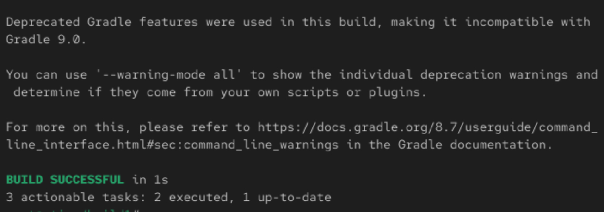
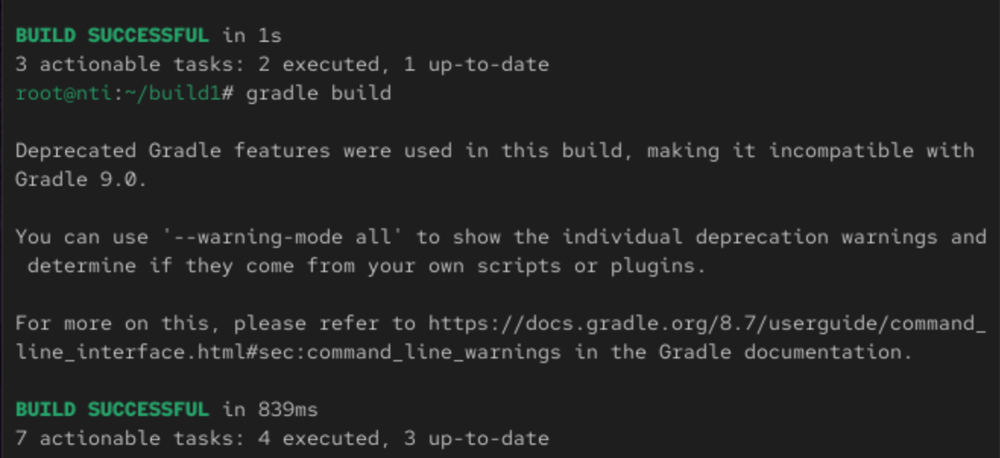

# 🧪 Lab 9: Build Java App using Gradle (CentOS + Java 21)

## 🔧 Requirements

✅ Java 21 

⬇️ Git

⚙️ Gradle (manual installation)

🌐 Internet access

## 1️⃣ Install Gradle (Manually)

📦 Download and extract Gradle 8.7:
```
wget https://services.gradle.org/distributions/gradle-8.7-bin.zip -P /tmp
sudo unzip -d /opt/gradle /tmp/gradle-8.7-bin.zip
```
🛠️ Add Gradle to your PATH:
```
echo "export PATH=/opt/gradle/gradle-8.7/bin:\$PATH" | sudo tee /etc/profile.d/gradle.sh
sudo chmod +x /etc/profile.d/gradle.sh
source /etc/profile.d/gradle.sh
```
✅ Verify installation:
```
gradle -v
```

## 2️⃣ Clone the Source Code 📥

```
git clone https://github.com/Ibrahim-Adel15/build1.git
cd build1
```

## 3️⃣ Run Unit Tests 🧪

```
gradle test
```
Output:



## 4️⃣ Build the Application 🏗️

```
gradle build
```
Output:



### Check JAR File 
```
tree build/libs
```
Output:
```
build/libs
└── ivolve-app.jar
```

## 5️⃣ Run the Application ▶️

```
java -jar build/libs/ivolve-app.jar
```
Output:


