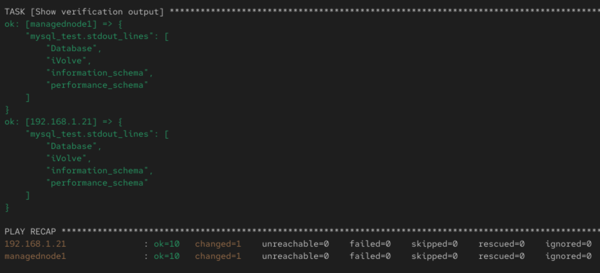

# 🧪 Lab 7: Ansible Vault

🛠️ Write Ansible playbook to automate the following tasks:

💾 Install MySQL.

🗃️ Create iVolve database.

👤 Create user with all privileges on the iVolve DB.

🔐 Use Ansible Vault to encrypt sensitive information such as database user password.

✅ Validate DB on managed node by connecting to database using the created user and listing databases.


## 📁 Project Folder Structure

```
lab7-ansible-vault/        
├── /etc/ansible/hosts            
├── mysql_setup.yml           
├── group_vars/            
│   └── all.yml        
```

## 🔐 Using Ansible Vault

Create an encrypted variables file for sensitive data (e.g., passwords):
```
ansible-vault create group_vars/all.yml
```

Store variables like this inside the vault:
```
mysql_root_password: shahd123
mysql_db_user: shahd
mysql_db_password: shahd123
```

## 📋 Sample Playbook 

```
---
- name: MySQL Setup with Vault-secured Credentials
  hosts: webservers
  become: yes

  vars_files:
    - group_vars/all.yml

  tasks:

    - name: Install MySQL
      package:
        name: mysql-server
        state: present

    - name: Ensure MySQL service is running
      service:
        name: mysqld
        state: started
        enabled: yes

    - name: Ensure Python 3 and pip are installed
      yum:
        name:
          - python3
          - python3-pip
        state: present

    - name: Install PyMySQL using pip3
      pip:
        name: pymysql
        executable: pip3

    - name: Create iVolve Database
      mysql_db:
        name: iVolve
        state: present
        login_user: root
        login_password: "{{ mysql_root_password }}"

    - name: Create MySQL user, grant privileges, and flush privileges
      shell: |
        mysql -u root -p{{ mysql_db_password }} -e "
        CREATE USER IF NOT EXISTS \"{{ mysql_db_user }}\"@\"%\" IDENTIFIED BY \"{{ mysql_db_password }}\";
        GRANT ALL PRIVILEGES ON iVolve.* TO \"{{ mysql_db_user }}\"@\"%\";
        FLUSH PRIVILEGES;"


    - name: Verify database connection using new user
      command: >
        mysql -u {{ mysql_db_user }} -p{{ mysql_db_password }} -e "SHOW DATABASES;"
      register: mysql_test
      changed_when: false

    - name: Show verification output
      debug:
        var: mysql_test.stdout_lines
```

## 🚀 Run the Playbook                                                                                   

```
ansible-playbook mysql_setup.yml --ask-vault-pass
```




