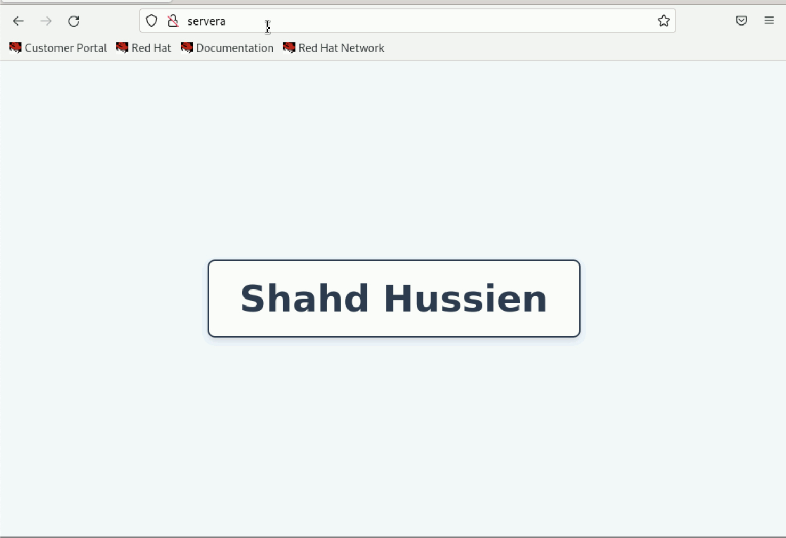
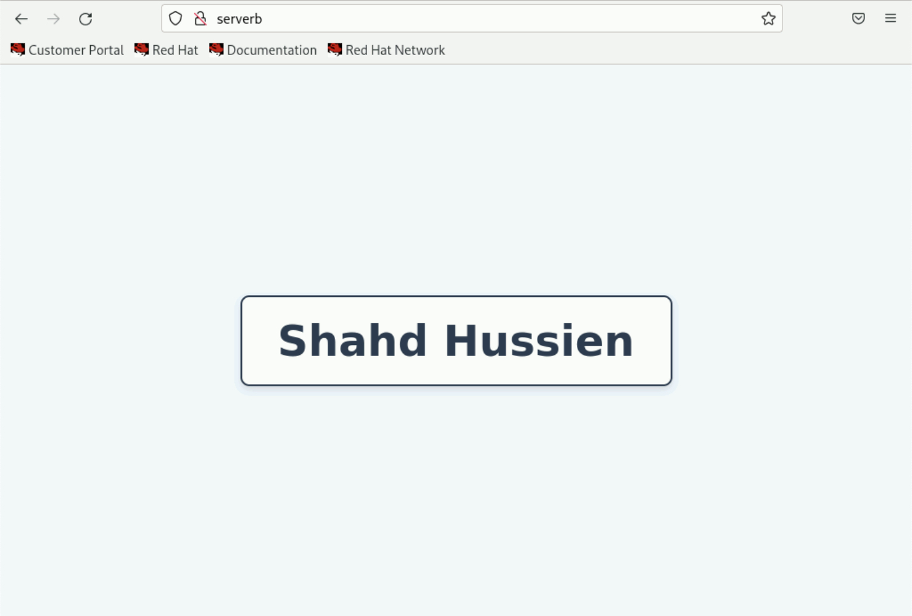

# Lab 5: Ansible Playbooks for Web Server Configuration

## 📌 Objective

This project demonstrates how to use an **Ansible playbook** to automate the installation and configuration of a web server using **Nginx**. The playbook performs the following tasks:

- Installs the Nginx web server on managed nodes
- Deploys a customized HTML landing page
- Ensures the Nginx service is enabled and running
- Configures the firewall to allow HTTP traffic

---

## 📁 Project Structure
```
├── hosts           
├── webserver.yml      
└── files/
    └── index.html 
```
## 📜 Ansible Playbook (`webserver.yml`)

```
- name: playbookl
  hosts: webservers
  become: yes
  tasks:
    - name: Install Nginx
      package:
        name: nginx 
        state: present

    - name: Enable nginx
      service:
        name: nginx
        state: started
        enabled: yes

    - name: Deploy custom index.html
      copy:
        src: files/imdex.html
        dest: /usr/share/nginx/html/index.html
        owner: root
        group: root
        mode: '0644'

    - name: Allow HTTP service in the firewall
      firewalld:
        service: http
        permanent: yes
        state: enabled
        immediate: yes
```

## 🗂️ Inventory File (hosts)

```
[webservers]
servera
serverb
```
## 🌐 Custom HTML Page (files/index.html)

```
<!DOCTYPE html>
<html lang="en">
<head>
    <meta charset="UTF-8">
    <title>Shahd Hussien</title>
    <style>
        body {
            background-color: #f0f8ff;
            font-family: 'Segoe UI', Tahoma, Geneva, Verdana, sans-serif;
            display: flex;
            justify-content: center;
            align-items: center;
            height: 100vh;
            margin: 0;
        }
        h1 {
            color: #2c3e50;
            font-size: 3em;
            border: 2px solid #2c3e50;
            padding: 20px 40px;
            border-radius: 10px;
            background-color: #ffffff;
            box-shadow: 0 4px 8px rgba(0,0,0,0.1);
        }
    </style>
</head>
<body>
    <h1>Shahd Hussien</h1>
</body>
</html>
```
## ▶️ Running the Playbook
Use the following command to execute the Ansible playbook:

```
ansible-playbook -i hosts webserver.yml
```
✅ Verifying the Deployment



