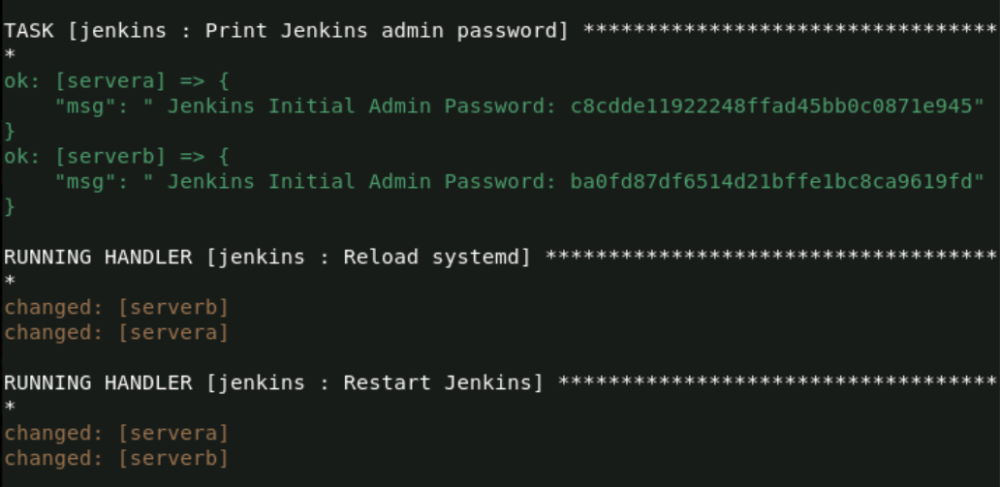
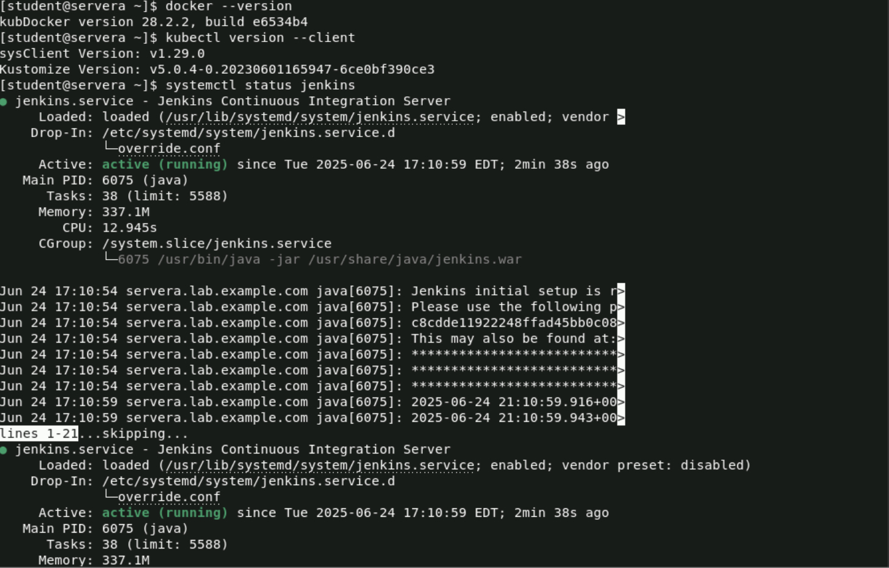

# Lab 6: Ansible Roles for Application Deployment 🚀
This lab demonstrates how to use Ansible roles to automate the installation of key DevOps tools: Docker, Kubernetes CLI (kubectl), and Jenkins. The tasks are modularized using roles for better reusability and structure.

## 🎯 Objective

-Create an Ansible role for each of the following:
    -Docker installation
    -Kubernetes CLI (kubectl) installation
    -Jenkins installation
-Write an Ansible playbook that runs the created roles
-Verify that all tools are installed successfully on the managed node

## 📁 Project Structure

```
ansible-deployment/
├── hosts
├── site.yml
└── roles/
    ├── docker/
    │   └── tasks/
    │       └── main.yml
    ├── kubectl/
    │   └── tasks/
    │       └── main.yml
    └── jenkins/
        └── tasks/
        │   └── main.yml
        └── handlers/
            └── main.yml   

```

# 🛠️ Step 1: Create Ansible Roles
You can create roles using the ansible-galaxy init command:

```
ansible-galaxy init roles/docker
ansible-galaxy init roles/kubectl
ansible-galaxy init roles/jenkins
```

# 📜 Step 2: Role Task Definitions
🔧 roles/docker/tasks/main.yml

```
---
# tasks file for roles/docker
- name: Install required packages
  package:
    name:
      - yum-utils
      - device-mapper-persistent-data
      - lvm2
    state: present

- name: Add Docker repository
  get_url:
    url: https://download.docker.com/linux/centos/docker-ce.repo
    dest: /etc/yum.repos.d/docker-ce.repo

- name: Install Docker
  package:
    name: docker-ce
    state: present

- name: Start and enable Docker service
  service:
    name: docker
    state: started
    enabled: yes
```

# ☸️ roles/kubectl/tasks/main.yml

```
- name: Download kubectl binary
  get_url:
    url: https://dl.k8s.io/release/v1.29.0/bin/linux/amd64/kubectl
    dest: /usr/local/bin/kubectl
    mode: '0755'

- name: Verify kubectl version
  command: kubectl version --client --output=yaml
  register: kubectl_version
  changed_when: false
```

# 🧩 roles/jenkins/tasks/main.yml

```
---
- name: Ensure Java 17 is installed
  package:
    name: java-17-openjdk
    state: present

- name: Set Java 17 as default
  shell: |
    alternatives --install /usr/bin/java java /usr/lib/jvm/java-17-openjdk*/bin/java 2
    alternatives --set java /usr/lib/jvm/java-17-openjdk*/bin/java
  args:
    executable: /bin/bash

- name: Add Jenkins repository
  get_url:
    url: https://pkg.jenkins.io/redhat-stable/jenkins.repo
    dest: /etc/yum.repos.d/jenkins.repo

- name: Import Jenkins GPG key
  rpm_key:
    key: https://pkg.jenkins.io/redhat-stable/jenkins.io-2023.key
    state: present

- name: Install Jenkins
  package:
    name: jenkins
    state: present

- name: Create systemd override directory
  file:
    path: /etc/systemd/system/jenkins.service.d
    state: directory
    mode: 0755

- name: Override Jenkins ExecStart to use jenkins.war with Java 17
  copy:
    dest: /etc/systemd/system/jenkins.service.d/override.conf
    content: |
      [Service]
      ExecStart=
      ExecStart=/usr/bin/java -jar /usr/share/java/jenkins.war
  notify:
    - Reload systemd
    - Restart Jenkins

- name: Enable and start Jenkins
  systemd:
    name: jenkins
    enabled: true
    state: started

- name: Wait for Jenkins to generate admin password
  wait_for:
    path: /var/lib/jenkins/secrets/initialAdminPassword
    timeout: 120

- name: Show Jenkins initial admin password
  command: cat /var/lib/jenkins/secrets/initialAdminPassword
  register: jenkins_password
  changed_when: false

- name: Print Jenkins admin password
  debug:
    msg: "Jenkins Initial Admin Password: {{ jenkins_password.stdout }}"
```

# 🧩 roles/jenkins/handlers/main.yml

```
---
- name: Reload systemd
  command: systemctl daemon-reexec

- name: Restart Jenkins
  systemd:
    name: jenkins
    state: restarted
```

# 🧾 Step 3: Write the Playbook (install_apps.yml)

```
---
- name: Deploy Docker, kubectl, and Jenkins on Web Servers
  hosts: webservers
  become: yes

  roles:
    - docker
    - kubectl
    - jenkins
```

# 📌 Step 4: Define Inventory (hosts)

```
[webservers]
servera
serverb
```
# ▶️ Step 5: Run the Playbook

```
ansible-playbook -i hosts install_apps.yml

```
Print Jenkins admin password:



# ✅ Step 6: Verification
Run the following commands on the managed node to verify successful installation:

```
docker --version
kubectl version --client
systemctl status jenkins
```

