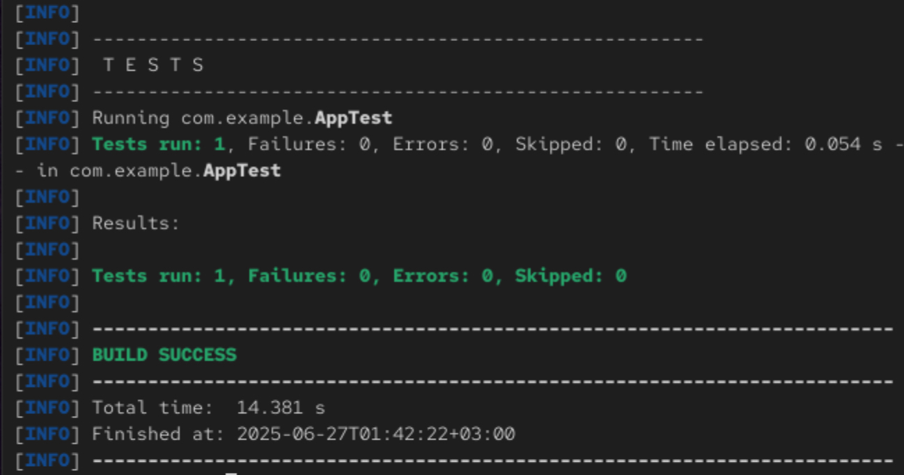
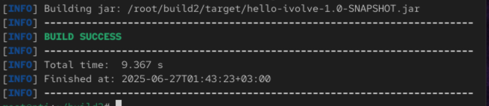
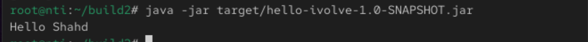

# 🧪 Lab 10: Build Java App using Maven

## 🔧 Requirements

✅ Java 21 

⬇️ Git

📦 Maven

🌐 Internet access

## 1️⃣ Install Maven

📥 Install via Yum:
```
yum install maven -y
```
✅ Verify installation:
```
mvn -v
```

## 2️⃣ Clone the Source Code 📥

```
git clone https://github.com/Ibrahim-Adel15/build2.git
cd build2
```

## 3️⃣ Run Unit Tests 🧪

```
mvn test
```
Output:



## 4️⃣ Build the Application 🏗️

```
mvn package
```
Output:



### Check JAR File 
```
tree target | grep .jar
```
Output:
```
├── hello-ivolve-1.0-SNAPSHOT.jar

```

## 5️⃣ Run the Application ▶️

```
java -jar target/hello-ivolve-1.0-SNAPSHOT.jar
```
Output:



