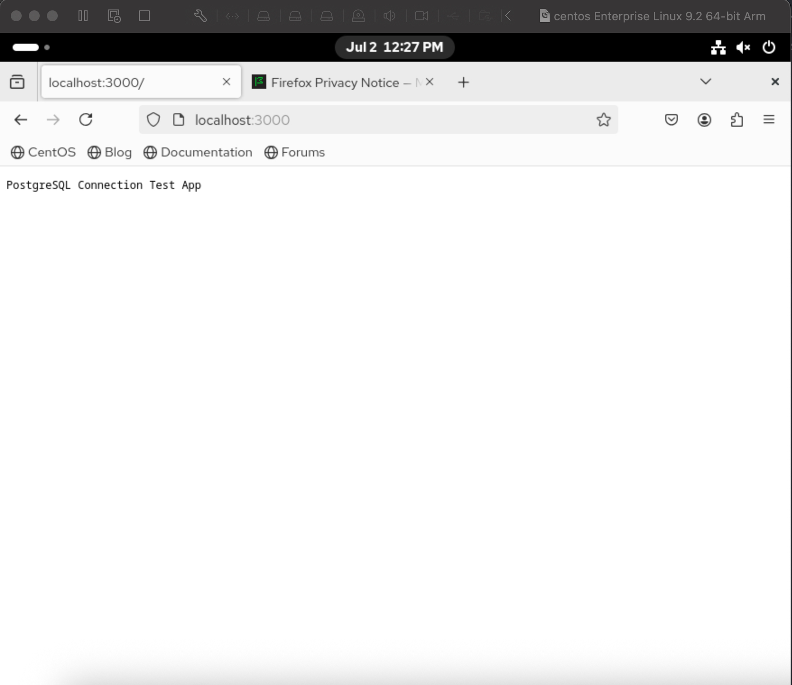

# Lab 16: 📘 Docker Compose Setup for Node.js + PostgreSQL App

This documentation explains how to set up and run a simple Node.js application connected to a PostgreSQL database using Docker Compose.

## 🧱 Project Structure

```
project-root/
│
├── Dockerfile
├── docker-compose.yml
├── .env
├── src/
│   └── app.js
```

## ⚙️ Requirements

- Docker
- Docker Compose (comes with Docker Desktop on macOS/Windows)
- Internet connection for pulling base images

## 📄 .env File

```
POSTGRES_USER=postgres
POSTGRES_PASSWORD=postgres
POSTGRES_DB=postgres
```

## 🐳 docker-compose.yml

```
version: "3.8"

services:
  app:
    build: .
    ports:
      - "3000:3000"
    depends_on:
      - db
    networks:
      - mynet

  db:
    image: postgres:15-alpine
    environment:
      POSTGRES_USER: ${POSTGRES_USER}
      POSTGRES_PASSWORD: ${POSTGRES_PASSWORD}
      POSTGRES_DB: ${POSTGRES_DB}
    ports:
      - "5432:5432"
    volumes:
      - postgres_data:/var/lib/postgresql/data
    networks:
      - mynet

volumes:
  postgres_data:

networks:
  mynet:
```


## 🚀 Run Compose File

```
docker compose up -d
```

## ✅ Verifying the Setup

### 1- Access the app in your browser: http://localhost:3000



### 2- Check logs:

```
docker compose logs app
```

```
app-1  | > postgres-node-app@1.0.0 start
app-1  | > node src/app.js
app-1  | 
app-1  | Successfully connected to PostgreSQL database
app-1  | Server running on http://localhost:3000
```


### 3- Inspect running containers:

```
docker ps
```

```
ONTAINER ID   IMAGE                COMMAND                  CREATED          STATUS          PORTS                                         NAMES
b3bcddf3ef9d   docker6-app          "docker-entrypoint.s…"   38 minutes ago   Up 33 minutes   0.0.0.0:3000->3000/tcp, [::]:3000->3000/tcp   docker6-app-1
2e5ff3082278   postgres:15-alpine   "docker-entrypoint.s…"   40 minutes ago   Up 33 minutes   0.0.0.0:5432->5432/tcp, [::]:5432->5432/tcp   docker6-db-1
```

### 4- Inspect volume:

```
docker volume ls
```

```
DRIVER    VOLUME NAME
local     docker6_postgres_data
```
