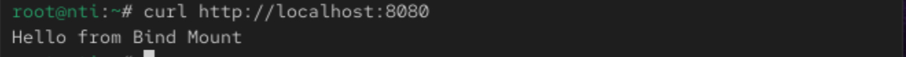
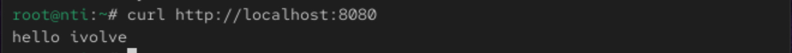
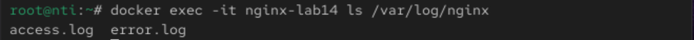

# 🧪 Lab 14: Docker Volume & Bind Mount with Nginx

## 📝 Objective
Learn how to use Volumes and Bind Mounts in Docker with an Nginx container.

## 🔧 Steps

### 1️⃣ Create a Docker Volume for Logs

```
docker volume create nginx.logs
```

### 2️⃣ Create Bind Mount Directory & HTML File

```
mkdir -p nginx-bind/html
echo "Hello from Bind Mount" > nginx-bind/html/index.html
```

### 3️⃣ Run Nginx Container with Volume & Bind Mount

```
docker run -d \
  --name nginx-lab14 \
  -v nginx.logs:/var/log/nginx \
  -v $(pwd)/nginx-bind/html:/usr/share/nginx/html \
  -p 8080:80 \
  nginx
```

### 4️⃣ Verify Nginx Page

```
curl http://localhost:8080
```
Output:



### 5️⃣ Edit HTML File & Re-verify

```
echo "Hello ivolve" > nginx-bind/html/index.html
```
```
curl http://localhost:8080
```



### 6️⃣ Check Logs Volume

```
ls /var/lib/docker/volumes/nginx.logs/_data/
```
Output:


### 7️⃣ Cleanup: Remove Volume

```
docker rm -f nginx-lab14
docker volume rm nginx.logs
```

