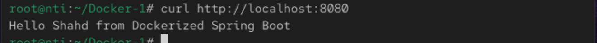

# 📘 Lab 12: Multi-Stage Build for a Java Spring Boot App using Docker

## 📌 Goal
Package and run a Java Spring Boot application inside a Docker container using multi-stage build to reduce image size and separate build/runtime environments.

## 📂 Step 1: Clone the Application Code

```
git clone https://github.com/ibrahim-Adel15/Docker-1.git
cd Docker-1
```

## 🛠️ Step 2: Create Dockerfile-multi-stage

### 👷 Stage 1: Build the application

```
FROM maven:3.9.6-eclipse-temurin-17 AS build

WORKDIR /app

COPY . .

RUN mvn package
```
### 🚀 Stage 2: Run the application

```
FROM eclipse-temurin:17-jdk

WORKDIR /app

COPY --from=build /app/target/demo-0.0.1-SNAPSHOT.jar app.jar

EXPOSE 8080

CMD ["java", "-jar", "app.jar"]
```

## 🧱 Step 3: Build the Docker Image

```
docker build -f Dockerfile-multi-stage -t my-img-multistage .
```

## ▶️ Step 4: Run the Container

```
docker run -d -p 8080:8080 --name my-app-multistage  my-img-multistage
```

## 🧪 Step 5: Test the Application

```
curl http://localhost:8080
```



## 🛑 Step 6: Stop and Remove the Container

```
docker stop my-app-multistage
docker rm my-app-multistage
```