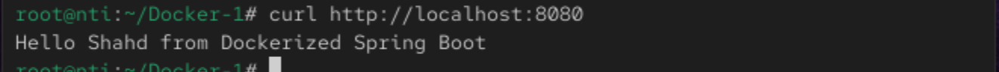

# 📘 Lab 11: Run Java Spring Boot App in a Container

## 🧩 Objective
Run a Spring Boot application inside a Docker container using two methods:
- Building the app inside the container
- Building the app outside the container

## 🔁 Steps (1): Build Inside the Container

### 1️⃣ Clone the Application Code

```
git clone https://github.com/ibrahim-Adel15/Docker-1.git
cd Docker-1
```

### 2️⃣ Create Dockerfile

```
FROM maven:3.9.6-eclipse-temurin-17

WORKDIR /app

COPY . .

RUN mvn package

EXPOSE 8080

CMD ["java", "-jar", "target/demo-0.0.1-SNAPSHOT.jar"]
```

### 3️⃣ Build Docker Image

```
docker build -t my-app .
```

### 4️⃣ Run the Container

```
 docker run -d -p 8080:8080 --name my-container my-app
```

### 5️⃣ Test the Application

```
curl http://localhost:8080
```



## 🔁 Steps (2): Build Outside the Container

### 1️⃣ Build the App Locally

```
mvn package
```

### 2️⃣ Create Dockerfile (Dockerfile.bulid-outside )

```
FROM maven:3.9.6-eclipse-temurin-17

WORKDIR /app

COPY target/demo-0.0.1-SNAPSHOT.jar app.jar

EXPOSE 8081

CMD ["java", "-jar", "app.jar"]
```

### 3️⃣ Build the Image

```
docker build -f Dockerfile.bulid-outside -t my-img-outside 
```

### 4️⃣ Run the Container

```
docker run -d -p 8081:8081 --name my-app-outside my-img-outside
```

### 5️⃣ Test Again

```
curl http://localhost:8081
```


## ** 📊 Size Comparison Between Build Methods

```
docker image ls
```

#### Output:
```
REPOSITORY       TAG       IMAGE ID       CREATED          SIZE
my-img-outside   latest    be35f951046b   14 minutes ago   495MB
my-app           latest    a08385f8f447   30 minutes ago   541MB
```
***  Building outside the container creates a lighter, cleaner image — faster to deploy, ship, and start. 


### 6️⃣ Stop & Delete the Container

```
docker stop my-img-outside my-app 
docker rm my-img-outside my-app 
```


