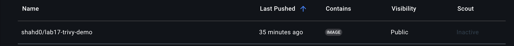

# 🔍 Lab 17: Scan Docker Image with Trivy

This lab demonstrates how to containerize a Java Maven Containerize a Java Maven application using Docker, build the app inside the container, scan the resulting Docker image for vulnerabilities using Trivy, generate a JSON report, and push the image to Docker Hub.

---

## Steps

### 1. Clone the project repository

```
git clone https://github.com/ibrahim-Adel15/Docker-1.git
cd Docker-1/Lab17
```

### 2. Create Dockerfile 

```
FROM maven:3.9.6-eclipse-temurin-17

WORKDIR /app
COPY . .

RUN mvn package 

EXPOSE 8080
CMD ["java", "-jar", "target/demo-0.0.1-SNAPSHOT.jar"]
```

###  Step 3. Build Docker Image

```
docker build -t shahd0/lab17-trivy-demo:latest .
```

###  Step 4. Install and run Trivy scan

```
wget https://github.com/aquasecurity/trivy/releases/download/v0.64.0/trivy_0.64.0_Linux-ARM64.tar.gz

tar -xzf trivy_0.64.0_Linux-ARM64.tar.gz

sudo mv trivy /usr/local/bin/

trivy --version 
```
##### Run the scan:

```
trivy image --format json --output trivy-report.json shahd0/lab17-trivy-demo:latest
```

### Step 5. Push the image to Docker Hub

```
docker login
docker push shahd0/lab17-trivy-demo:latest
```


## Output

JSON vulnerability report: [vulnerability.json](view)