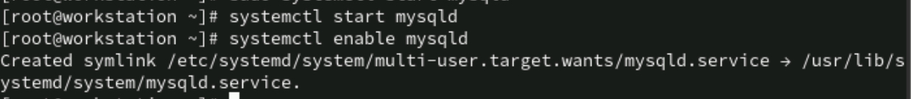
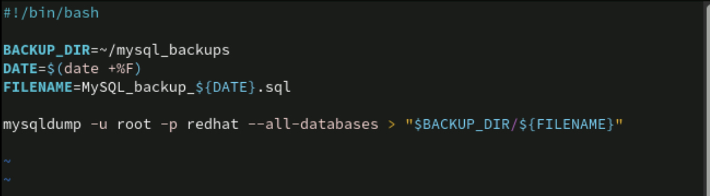
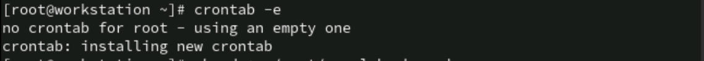
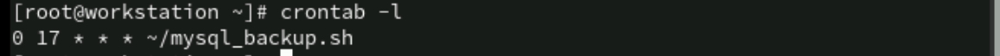
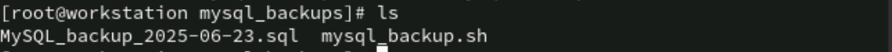

Lab 1: Shell Scripting Basics
Shell Scripting Basics including MySQL installation, backup script creation, and setting up a cron job.

Objective

-Install MySQL database.
-Create a directory to store backups.
-Write a shell script to take a MySQL database backup using mysqldump.
-Schedule the script to run daily at 5:00 PM using cron.

1️⃣ Install MySQL Database

2️⃣ Create a Directory for Backups

3️⃣ Create Shell Script for MySQL Backup

4️⃣ Set Up Cron Job to Run Daily at 5:00 PM

list the backup files

