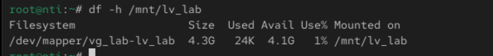

# 🛠️ Lab 2: Disk Management and Logical Volume Setup

## 🎯 Objective:

Attach a new 6 GB disk to your VM 💾

Create two partitions: 2 GB and 3 GB 🔧

Initialize the 2 GB partition as a Volume Group (VG) and create a Logical Volume (LV) inside it 🗃️

Extend the Logical Volume by adding the 3 GB partition to the existing Volume Group ➕🖥️

## 📝 Step-by-step Instructions

## 1. Attach a new 6 GB disk to your VM
Use VirtualBox/VMware to add a new 6 GB virtual disk ➕💾

Boot your VM and verify the disk:

```
lsblk
```
## 2. Create two partitions on the new disk
Use fdisk or parted:

```
fdisk /dev/nvme0n2
```
Create a 2 GB partition → /dev/nvme0n2p1 🟢
Create a 3 GB partition → /dev/nvme0n2p2 🔵

# 3. Initialize the 2 GB partition as Physical Volume (PV)

```
pvcreate /dev/nvme0n2p1
```

# 4. Create Volume Group (VG) with the 2 GB PV

```
vgcreate vg_lab /dev/nvme0n2p1
```
# 5. Create Logical Volume (LV) inside VG

```
lvcreate -L 1.9G -n lv_lab vg_lab
```

# 6. Format and mount the Logical Volume

```
mkfs.ext4 /dev/vg_lab/lv_lab
mkdir /mnt/lv_lab
mount /dev/vg_lab/lv_lab /mnt/lv_lab
```
Check space:

```
df -h /mnt/lv_lab
```

# 7. Initialize the 3 GB partition as Physical Volume (PV)

```
pvcreate /dev/nvme0n2p2
```
# 8. Extend the Volume Group by adding the 3 GB PV

```
vgextend vg_lab /dev/nvme0n2p2
```

# 9. Extend the Logical Volume to use the new space

```
lvextend -l +100%FREE /dev/vg_lab/lv_lab
```

# 10. Resize the filesystem

```
resize2fs /dev/vg_lab/lv_lab
```

# 11. Verify everything

```
df -h /mnt/lv_lab
```

