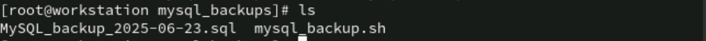

# Lab 1: Shell Scripting Basics 
This lab covers essential shell scripting tasks including installing MySQL, creating a backup script, and scheduling it using cron.

## 🎯 Objective

Install the MySQL database server
Create a directory for storing database backups
Write a shell script to back up MySQL databases using mysqldump
Schedule the backup script to run daily at 5:00 PM via cron

# 1️⃣ Install MySQL Database
Run the following commands to install and start the MySQL service:

```
yum install mysql-server
systemctl start mysqld
systemctl enable mysqld
```

## 2️⃣ Create a Directory for Backups 📁
Create a directory to store the backup files:

```
mkdir -p ./mysql_backups
```

## 3️⃣ Create the MySQL Backup Script 💾
Create a shell script named mysql_backup.sh with the following content:

```
#!/bin/bash
BACKUP_DIR=~/mysql_backups
DATE=$ (date +%F)
FILENAME=MySQL_backup_${DATE}.sql

mysqldump -u root -p redhat --all-databases › "$BACKUP_DIR/${FILENAME}"
```

## 4️⃣ Schedule the Backup Script Using Cron ⏰
Edit the crontab to schedule the script to run daily at 5:00 PM:

```
crontab -e
```
```
0 17 * * * ~/mysql_backup.sh
```

## 5️⃣ Verify Backup Files ✅
After the cron job runs, list the backup directory to verify the backups:

