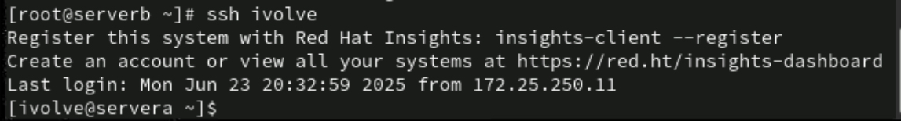

Lab 3: SSH Configurations 

Objective
Configure secure, password-less SSH access to a remote machine using public/private key authentication and simplify connection using SSH configuration file.

1. Generate Public & Private SSH Keys

2. Securely Transfer the Public Key to the Remote Machine

3. Configure SSH for Easy Access (ssh ivolve)

4. Test SSH Shortcut

