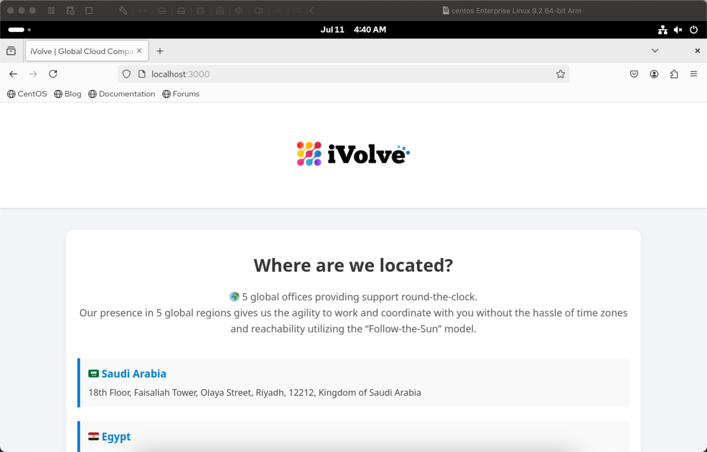
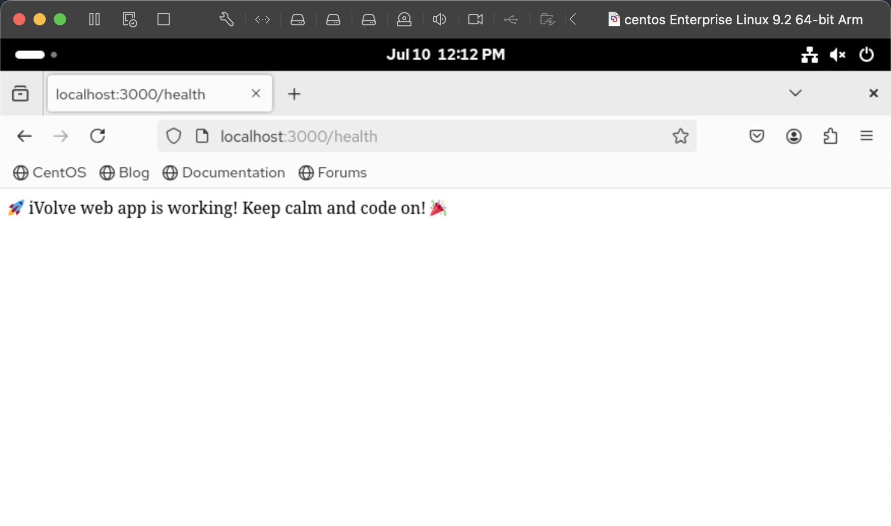
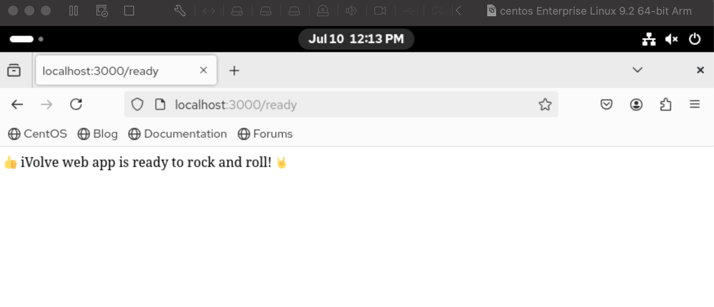

# Lab 18: Containerized Node.js and MySQL Stack Using Docker Compose

## Objective
Set up and run a Node.js application with a MySQL database using Docker Compose. The app requires a connection to MySQL and expects a database named ivolve to function.

## Requirements

- Clone the application source code from GitHub.
- Ensure MySQL has a database named ivolve.
- Create a docker-compose.yml file with two services:
- App service: built from a local Dockerfile, exposes port 3000, uses environment variables for DB connection.
- DB service: runs MySQL image, initializes database ivolve, sets root password, and uses a persistent volume.
- Verify the app is working by accessing its endpoints /health and /ready.
- Check application access logs inside /app/logs/.
- Push the Docker image to DockerHub.

## Steps

### 1. Clone the source code

```
git clone https://github.com/ibrahim-Adel15/kubernets-app.git
cd kubernets-app
```

### 2. Create the docker-compose.yml file

```
version: '3.8'

services:
  app:
    build: .
    ports:
      - "3000:3000"
    environment:
      - DB_HOST=${DB_HOST}
      - DB_USER=${DB_USER} 
      - DB_PASSWORD=${DB_PASSWORD}
    depends_on:
      - db
    volumes:
      - ./logs:/app/logs

  db:
    image: mysql:8.0
    environment:
      MYSQL_ROOT_PASSWORD: ${DB_PASSWORD}
      MYSQL_DATABASE: ${MYSQL_DATABASE}
    volumes:
      - db_data:/var/lib/mysql

volumes:
  db_data:
```

### 3. Build and run the services

```
docker compose up --build
```

### 4. Verify the application

Visit: http://localhost:3000 to check if the app is running.



Health check endpoint: http://localhost:3000/health\




Readiness check endpoint: http://localhost:3000/ready



### 5. Verify application logs

```
docker exec -it kubernets-app-app-1 cat /app/logs/access.log
```
```
172.18.0.1 - - [10/Jul/2025:09:11:12 +0000] "GET / HTTP/1.1" 200 2769 "-" "Mozilla/5.0 (X11; Linux x86_64; rv:128.0) Gecko/20100101 Firefox/128.0"
172.18.0.1 - - [10/Jul/2025:09:11:12 +0000] "GET /assets/ivolve-logo.png HTTP/1.1" 200 100268 "http://localhost:3000/" "Mozilla/5.0 (X11; Linux x86_64; rv:128.0) Gecko/20100101 Firefox/128.0"
172.18.0.1 - - [10/Jul/2025:09:11:13 +0000] "GET /favicon.ico HTTP/1.1" 404 150 "http://localhost:3000/" "Mozilla/5.0 (X11; Linux x86_64; rv:128.0) Gecko/20100101 Firefox/128.0"
172.18.0.1 - - [10/Jul/2025:09:12:02 +0000] "GET /health HTTP/1.1" 200 59 "-" "Mozilla/5.0 (X11; Linux x86_64; rv:128.0) Gecko/20100101 Firefox/128.0"
172.18.0.1 - - [10/Jul/2025:09:13:24 +0000] "GET /ready HTTP/1.1" 200 51 "-" "Mozilla/5.0 (X11; Linux x86_64; rv:128.0) Gecko/20100101 Firefox/128.0"
```

### 6. Build the Docker image with your DockerHub username and tag

```
docker build -t shahd0/kubernetes-app:v1 .
```

### 7. Login to DockerHub

```
docker login
```

### 8. Push the image to DockerHub

```
docker push shahd0/kubernetes-app:v1
```